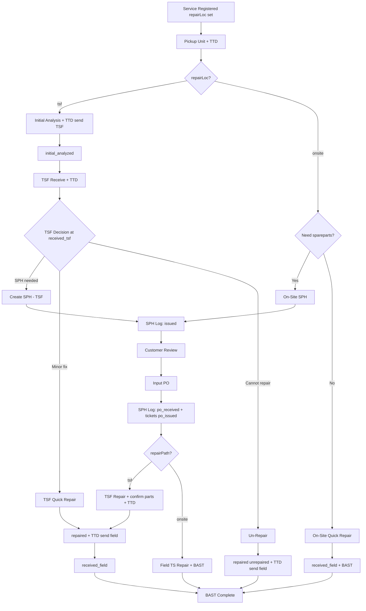

# PRD — Master Sparepart & SPH (Surat Penawaran Harga)

| Field | Value |
|-------|-------|
| **Product** | TMS — Tool Management System |
| **Module** | Master Sparepart, SPH Builder, SPH Log, Service & Repair Integration |
| **Version** | **1.4.1** (Target Release: v6.7.2) |
| **Date** | 2026-06-06 |
| **Status** | Approved — Full Specification (Phase 1–6 complete) |

---

## 1. Executive Summary

TMS membutuhkan **Master Sparepart** sebagai sumber data tunggal (*single source of truth*) untuk komponen pengganti unit medis. Data ini menjadi dasar pembuatan **SPH (Surat Penawaran Harga)** yang terhubung dengan alur **Service & Repair Customer**, sehingga:

- TSF **atau teknisi lapangan (On-Site)** dapat membuat penawaran berbasis sparepart master.
- **Setiap SPH yang terbit dicatat sebagai dokumen/tiket SPH** di **SPH Log** — bukan hanya perubahan status service ticket.
- **Sinkronisasi SPH → PO**: saat PO diinput, status SPH berubah menjadi `po_received` sehingga terlihat SPH mana yang sudah/belum jadi PO.
- Customer mendapat informasi jelas: **sparepart apa yang diganti** beserta harganya.
- Satu SPH dapat mencakup **beberapa unit/service ticket** selama masih **satu customer yang sama** (jalur TSF saja).
- Smart Fill mengisi otomatis **Description** dan **Harga** saat **Art Number** diketakan/dipilih.
- Perbaikan ringan dapat lewat **Quick Repair** (On-Site atau TSF) tanpa SPH/PO.
- Unit yang tidak dapat diperbaiki diproses lewat **Un-Repair** (TSF) dengan pengembalian resmi.
- Penyerahan multi-unit ke customer yang sama dapat lewat **Bulk BAST**; setiap tahap handover dapat dicetak via **Tanda Terima**.

---

## 2. Problem Statement

### Kondisi Saat Ini (AS-IS) — sebelum modul ini

| Area | Keterbatasan |
|------|----------------|
| Penawaran TSF | `quoteDetails` berupa textarea teks bebas; tidak terstruktur |
| Harga | `quotePrice` diinput manual; rawan salah hitung |
| SPH | Tidak ada registry; sulit lacak SPH pending vs PO |
| On-Site repair | Langsung repair & BAST tanpa jalur SPH/sparepart |
| PO | PO hanya di service ticket; tidak update dokumen SPH |
| Multi-unit | Satu customer 2+ unit harus SPH terpisah |
| Audit | Tidak ada entitas SPH terpisah; history tersebar |

### Kondisi Target (TO-BE)

- Master sparepart + batch import/export Excel/CSV.
- SPH dari line items master; preview customer: **Art Number | Description | Harga**.
- **SPH Log** — registry semua SPH dengan status `issued` / `po_received`.
- **Dua jalur repair**: TSF Workshop dan **On-Site** (tanpa kirim ke TSF).
- **PO sync** ke `sphDocuments` + semua service ticket terkait (combined SPH).
- Smart Fill, combined SPH, replaced parts tracking, cloud sync.
- Quick Repair (On-Site + TSF) dan Un-Repair terdokumentasi penuh.
- Handover digital (TTD) di setiap transisi fisik unit.

---

## 3. Gap Analysis

### 3.1 Gap v1.0 → v1.1

| # | Gap | Resolusi |
|---|-----|----------|
| G-01 | Tidak ada alur On-Site + SPH | Jalur `picked_up` + `repairLoc=onsite` → On-Site SPH → PO → Repair & BAST |
| G-02 | SPH tidak punya registry terpisah | Menu **SPH Log** + `sphDocuments[]` |
| G-03 | PO tidak sinkron ke SPH | `syncSphPoFromServiceTicket()` |
| G-04 | Combined SPH + PO partial | PO sync update semua `serviceTicketIds` |
| G-05 | Status SPH terlalu sederhana | `issued` \| `po_received` \| `cancelled` |
| G-06 | `repairPath` tidak tercatat | Field `repairPath`: `tsf` \| `onsite` |
| G-07 | Quick repair On-Site | Tombol Quick Repair tanpa SPH |
| G-08 | SPH history terpisah | `sphDocuments.history[]` + `historyLog` |
| G-09 | Filter SPH pending PO | Filter SPH Log: All / Pending PO / PO Received |
| G-10 | Partial search Smart Fill | Dropdown autocomplete Art Number (Phase 5 — v6.7.0) |
| G-11 | TSF tanpa Quick Repair | TSF Quick Repair di `received_tsf` |

### 3.2 Gap v1.1 → v1.2 (audit dokumen)

| # | Gap | Resolusi v1.2 |
|---|-----|---------------|
| G-12 | Un-Repair tidak didokumentasikan | §6.2b + BR-UR + AC-27 |
| G-13 | Status `initial_analyzed` hilang | Timeline TSF lengkap §6.2 |
| G-14 | Handover/TTD tidak di PRD | §6.8 Digital Handover |
| G-15 | AC-01–16 hilang | §10 lengkap |
| G-16 | Sparepart Master UI hilang | §7.1 lengkap |
| G-17 | Role matrix tidak ada | §7.5 Permission Matrix |
| G-18 | Combined labor split tidak jelas | BR-11 |
| G-19 | Diagram Mermaid tidak lengkap | §6.1 diupdate |
| G-20 | Versi release tidak sinkron | v6.5.1 Phase 4.1 |

### 3.3 Gap v1.2 → v1.3 (adjacent flows)

| # | Gap | Resolusi v1.3 |
|---|-----|---------------|
| G-21 | Bulk BAST tidak didokumentasikan | §6.9 + AC-31 |
| G-22 | Tanda Terima / receipt cetak tidak ada | §6.10 + AC-32 |
| G-23 | Legacy PO tanpa `sphDocumentId` | §5.4 + BR-17 |
| G-24 | Notifikasi status service tidak ada | §6.11 |
| G-25 | Cloud sync behavior minimal | §5.5 |

### 3.4 Patch v1.3 → v1.3.1 (konsistensi dokumen)

| # | Koreksi |
|---|---------|
| P-01 | G-10 & Non-Goals: partial search / PDF export diselaraskan ke **Phase 5 (v6.6.0)** |
| P-02 | §7.2 SPH detail: spec diperbaiki — implementasi memakai **summary alert**, bukan modal terpisah |
| P-03 | BR-OS-05: UX fix modal On-Site diselaraskan ke **Phase 6 (v6.7.0)** |

---

## 4. Goals & Non-Goals

### Goals

1. CRUD Master Sparepart (Art Number, Description, Price, Group, Status).
2. Batch import + export Excel/CSV sparepart.
3. Smart Fill dari Art Number (exact match).
4. SPH Builder single + combined (same customer, TSF path).
5. **SPH Log** — registry setiap SPH terbit.
6. **On-Site repair path** dengan SPH + PO + konfirmasi sparepart.
7. **TSF repair path** dengan SPH + PO, Quick Repair, atau Un-Repair.
8. **SPH ↔ PO synchronization**.
9. Customer table SPH: Art Number, Description, Harga only.
10. Konfirmasi `replacedSpareparts` pasca-repair.
11. Cloud sync via Supabase JSON.
12. Digital handover signatures di setiap transisi fisik.
13. Bulk BAST dan Tanda Terima (cetak) terdokumentasi.
14. Legacy PO path dan cloud sync behavior terdokumentasi.
15. **PDF export SPH** — layout korporat via print dialog (Phase 5).
16. **Partial Smart Fill** — autocomplete saat ketik Art Number (Phase 5).
17. **SPH cancel flow** — batalkan SPH `issued`, revert tiket terkait (Phase 6).
18. **On-Site quotation UX** — tanpa opsi Un-Repair; label path-specific (Phase 6).
19. **Combined SPH customer picker** — pilih customer jika >1 eligible (Phase 6).

### Non-Goals (v1.4.0)

- ERP/SAP integration, stock qty, multi-currency.
- Validasi PO amount harus sama dengan SPH total *(tidak diimplementasikan — PO amount independen)*.
- Logo RS kustom per customer di PDF *(header TMS generik saja)*.

---

## 5. Data Model

### 5.1 `spareparts[]`

```json
{
  "id": 1001,
  "artNo": "ART-SP-001",
  "description": "Power Supply Module 24V",
  "price": 2500000,
  "group": "Avitum",
  "status": "active",
  "notes": "",
  "updatedAt": "2026-06-06T10:00:00.000Z"
}
```

| Field | Rule |
|-------|------|
| `artNo` | Unik (case-insensitive via `normArtKey`) |
| `group` | `Avitum` \| `Hospital Care` \| `Aesculap` \| `General` |
| `status` | `active` \| `discontinued` \| `obsolete` — Smart Fill hanya `active`; `obsolete` diblokir |

### 5.2 `sphDocuments[]` — Entitas Tiket SPH

Setiap kali SPH terbit, **wajib** membuat record baru di `sphDocuments`.

```json
{
  "id": 2001,
  "sphNo": "SPH-2606-0001",
  "customerId": 5,
  "customerName": "RS Pelita Husada",
  "serviceTicketIds": [101, 102],
  "repairPath": "tsf",
  "lines": [
    {
      "sparepartId": 1001,
      "artNo": "ART-SP-001",
      "description": "Power Supply Module 24V",
      "unitPrice": 2500000,
      "qty": 1,
      "subtotal": 2500000,
      "serviceTicketId": 101
    }
  ],
  "laborAmount": 500000,
  "totalAmount": 3000000,
  "status": "issued",
  "poNumber": null,
  "poAmount": null,
  "poDate": null,
  "docPo": null,
  "poReceivedAt": null,
  "poReceivedBy": null,
  "docSph": null,
  "createdBy": 3,
  "createdAt": "2026-06-06T11:00:00.000Z",
  "updatedAt": "2026-06-06T11:00:00.000Z",
  "notes": "",
  "history": []
}
```

| Field | Description |
|-------|-------------|
| `sphNo` | Auto `SPH-YYMM-####` |
| `repairPath` | `tsf` = workshop \| `onsite` = perbaikan di customer |
| `status` | `issued` \| `po_received` \| `cancelled` *(future UI)* |
| `serviceTicketIds` | Semua service ticket yang tercakup |
| `lines[].qty` | Min 1; `subtotal = qty × unitPrice` |
| `lines[].serviceTicketId` | Opsional — untuk combined SPH per-unit allocation |
| `poNumber/Amount/Date/docPo` | Diisi saat PO sync |
| `history` | Audit trail perubahan SPH |

**Lifecycle SPH:**

```
[Create SPH] → status: issued
[PO Input on any linked ticket] → status: po_received (+ all tickets → po_issued)
[Cancel] → status: cancelled (manual, future)
```

### 5.3 Extension `serviceTickets[]`

```json
{
  "repairLoc": "tsf",
  "initialAnalysis": "Kerusakan modul power supply",
  "tsfAnalysis": "Komponen PS-24V rusak, perlu penggantian",
  "sparepartLines": [],
  "sphDocumentId": 2001,
  "replacedSpareparts": [],
  "quoteDetails": "auto-generated from lines",
  "quotePrice": 3000000,
  "toolStatus": "repaired",
  "repairCompletionType": "tsf_quick",
  "repairNote": "Kalibrasi ulang selesai",
  "poNumber": null,
  "poAmount": null,
  "poDate": null,
  "docSph": null,
  "docPo": null,
  "unitPhotoBefore": [],
  "unitPhotoAfter": [],
  "signaturePickupGiver": null,
  "signaturePickupReceiver": null,
  "signatureTsfGiver": null,
  "signatureTsfReceiver": null,
  "signatureSendFieldGiver": null,
  "signatureFieldReceiver": null,
  "signatureDeliveryGiver": null,
  "signatureDeliveryReceiver": null,
  "bulkBastId": null
}
```

| Field | Purpose |
|-------|---------|
| `repairLoc` | `tsf` \| `onsite` — dipilih saat **registrasi service**; menentukan seluruh jalur |
| `initialAnalysis` | Analisa awal teknisi lapangan (jalur TSF, status `initial_analyzed`) |
| `tsfAnalysis` | Hasil inspeksi lanjutan TSF (quotation modal) |
| `sphDocumentId` | FK ke `sphDocuments`; null jika Quick Repair / belum SPH |
| `sparepartLines` | Rencana penggantian dari SPH |
| `replacedSpareparts` | Konfirmasi sparepart terpasang pasca-repair |
| `toolStatus` | `repaired` \| `unrepaired` |
| `repairCompletionType` | `tsf_quick` jika TSF Quick Repair; null untuk alur normal |
| `quoteDetails` / `quotePrice` | Snapshot penawaran (auto dari line items + labor) |
| `docSph` / `docPo` | Upload dokumen resmi (base64 compressed) |
| `signature*` | TTD digital per tahap handover (lihat §6.8) |
| `bulkBastId` | ID BAST gabungan (`BAST-GBK-{timestamp}`) jika diselesaikan via Bulk BAST |

### 5.4 Legacy Compatibility & Data Migration

Modul SPH dirancang untuk tiket **baru** yang memakai `sphDocuments`. Tiket lama atau edge case berikut tetap didukung:

| Kondisi | Perilaku sistem |
|---------|-----------------|
| Tiket `quoted` **tanpa** `sphDocumentId` | PO input langsung ke tiket → `po_issued` (tanpa update SPH Log) |
| `quoteDetails` teks bebas (pre-v6.4) | Tetap tampil di service detail; tidak di-migrate otomatis ke line items |
| `spareparts[]` duplikat `artNo` | `sanitizeDB()` dedupe by normalized art key saat load |
| `sphDocuments[]` / `spareparts[]` null | Diinisialisasi array kosong saat `loadDB()` |

**Aturan migrasi manual (disarankan):**

1. Tiket lama di status `quoted` dengan harga manual → buat SPH baru hanya jika masih `received_tsf` / `picked_up` onsite **dan** belum ada `sphDocumentId`.
2. Jangan hapus `quoteDetails` lama — pertahankan untuk audit.

**PO dual-path (`submitServicePo`):**

```
if (ticket.sphDocumentId) → syncSphPoFromServiceTicket()  // preferred
else                       → direct po_issued on ticket only  // legacy fallback
```

### 5.5 Cloud Sync (Supabase)

| Aspek | Perilaku |
|-------|----------|
| Storage | Tabel `tms_sync`, row `id=1`, kolom `db_data` (full JSON DB) |
| Versioning | `db.version` monotonic; cloud `db_version` dibandingkan saat sync |
| Upload | Jika `localVersion > cloudVersion` atau `forceUpload` |
| Download | Jika `cloudVersion > localVersion` — replace local DB |
| Scope modul SPH | `spareparts[]`, `sphDocuments[]`, `serviceTickets[]` ikut full sync |
| Conflict | Last-write-wins berdasarkan `db.version` (bukan field-level merge) |
| Realtime | Supabase channel memicu re-fetch saat cloud berubah |

---

## 6. User Flows

### 6.1 Dual-Path Flow Diagram (v1.2)



### 6.2 TSF Workshop Path — Timeline Lengkap

| Step | Status | Actor | Action |
|------|--------|-------|--------|
| 0 | `registered` | Admin/SPV | Registrasi service + pilih `repairLoc=tsf` |
| 1 | `picked_up` | TS (field) | Pickup unit + TTD customer ↔ teknisi |
| 2 | `initial_analyzed` | TS (field) | Analisa awal + TTD kirim ke TSF (`send_tsf`) |
| 3 | `received_tsf` | TSF | Terima unit + TTD penerimaan workshop |
| 4a | `received_tsf` | TSF | **Damage Quotation** → Create SPH |
| 4b | `received_tsf` | TSF | **TSF Quick Repair** (tanpa SPH) |
| 4c | `received_tsf` | TSF | **Un-Repair** (unit tidak bisa diperbaiki) |
| 5 | — | System | SPH issued → `sphDocuments` + SPH Log `issued` |
| 6 | `quoted` | — | Service ticket(s) linked ke SPH |
| 7 | — | TS/TSF/SPV/Owner | Input PO |
| 8 | — | System | SPH → `po_received`; tickets → `po_issued` |
| 9 | `po_issued` | TSF | Selesai perbaikan + konfirmasi sparepart + TTD kirim lapangan |
| 10 | `repaired` | — | Unit dikirim TSF → TS |
| 11 | `received_field` | TS (field) | Terima unit + TTD |
| 12 | `completed` | TS (field) | BAST penyerahan ke customer + TTD |

### 6.2a TSF Quick Repair

| Step | Status | Action |
|------|--------|--------|
| 1 | `received_tsf` | TSF Quick Repair — work notes + foto opsional |
| 2 | `repaired` | TTD handover TSF → teknisi lapangan |
| 3 | `received_field` → `completed` | BAST ke customer |

| ID | Rule |
|----|------|
| BR-TSF-QR-01 | Hanya saat `received_tsf` + belum ada `sphDocumentId` |
| BR-TSF-QR-02 | Tidak membuat `sphDocuments` |
| BR-TSF-QR-03 | `repairCompletionType = tsf_quick` |
| BR-TSF-QR-04 | Jika perlu sparepart berbayar → Damage Quotation |

### 6.2b TSF Un-Repair

**Trigger:** Modal Damage Quotation → decision *Not Repairable — Return Unit*.

| Step | Status | Action |
|------|--------|--------|
| 1 | `received_tsf` | TSF inspeksi → keputusan Un-Repair + catatan `tsfAnalysis` |
| 2 | — | `toolStatus = unrepaired`; tidak buat SPH |
| 3 | `repaired` | TTD handover TSF → teknisi (unit dikembalikan apa adanya) |
| 4 | `received_field` → `completed` | BAST dengan pernyataan *unrepaired* |

| ID | Rule |
|----|------|
| BR-UR-01 | Hanya jalur TSF (`repairLoc = tsf`) di status `received_tsf` |
| BR-UR-02 | Tidak membuat `sphDocuments` |
| BR-UR-03 | `quotePrice = 0`; `quoteDetails` = pesan Un-Repair standar |
| BR-UR-04 | BAST customer memakai pernyataan berbeda untuk kondisi unrepaired |

### 6.3 On-Site Repair Path

**Precondition:** `repairLoc = onsite` saat registrasi service.

| Step | Status | Actor | Action |
|------|--------|-------|--------|
| 1 | `picked_up` | TS (field) | On-Site SPH **atau** Quick Repair |
| 2 | `quoted` | — | Menunggu PO (jika SPH) |
| 3 | — | TS/TSF/SPV/Owner | Input PO → sync ke SPH |
| 4 | `po_issued` | TS (field) | Repair & BAST + konfirmasi sparepart |
| 5 | `completed` | — | Customer informed |

**On-Site Quick Repair (tanpa sparepart):**

| Step | Status | Action |
|------|--------|--------|
| 1 | `picked_up` | Quick Repair → langsung `received_field` |
| 2 | `completed` | BAST penyerahan (skip `repaired` / handover TSF) |

| ID | Rule |
|----|------|
| BR-OS-01 | On-Site SPH hanya saat `picked_up` + belum ada `sphDocumentId` |
| BR-OS-02 | Setelah SPH issued, wajib PO sebelum Repair & BAST (alur berbayar) |
| BR-OS-03 | Quick Repair tidak membuat `sphDocuments` |
| BR-OS-04 | `repairPath` pada SPH = `onsite` |
| BR-OS-05 | On-Site tidak memakai opsi Un-Repair TSF — `configureQuotationModalForTicket()` menyembunyikan decision wrap dan menyesuaikan label/judul modal |

### 6.4 SPH Log — Registry Tiket SPH

**Prinsip:** Setiap SPH terbit = 1 record di `sphDocuments` + tampil di **SPH Log**.

| Column | Content |
|--------|---------|
| SPH No. | `SPH-2606-0001` |
| Customer | Nama RS |
| Path | On-Site / TSF badge |
| Service Tickets | Daftar `noService` |
| Total | Rp amount |
| SPH Status | Pending PO / PO Received |
| PO No. | Nomor PO atau — |
| Actions | Detail (`showSphDetail`) |

**Stats:** Total SPH | Pending PO | PO Received

**Filters:** All | Pending PO (`issued`) | PO Received (`po_received`)

**Search:** SPH No., customer name, PO number.

### 6.5 SPH ↔ PO Synchronization

**Trigger:** `submitServicePo()` pada service ticket yang memiliki `sphDocumentId`.

**Behavior:**

1. Cari `sphDocuments` by `sphDocumentId`.
2. Update SPH: `status → po_received`, PO fields, `poReceivedAt`, `poReceivedBy`.
3. Untuk **setiap** `serviceTicketId` dalam SPH dengan status `quoted` → copy PO → `po_issued`.
4. History + `notifyServiceUpdate` per tiket.
5. SPH Log menampilkan PO No.

**Combined SPH:** Input PO pada **salah satu** tiket cukup — semua tiket dalam SPH ikut ter-update.

**Catatan:** `poAmount` diinput manual — **tidak divalidasi** terhadap `sphDocuments.totalAmount`.

### 6.6 Combined SPH

| Rule | Detail |
|------|--------|
| Minimum | ≥2 service tickets |
| Customer | Same `customerId` only |
| Status eligible | `received_tsf` only (`canIssueSphForTicket`) — **bukan On-Site** |
| Output | 1 `sphDocument` → N tickets → 1 PO sync updates all |
| Labor split | **Labor amount hanya ke tiket pertama**; tiket lain = subtotal sparepart lines mereka saja |
| Line allocation | `serviceTicketId` opsional per line untuk alokasi per unit |
| UI | Tombol **Combined SPH** di Customer Service view (muncul jika eligible) |
| Multi-customer | Jika >1 customer punya ≥2 tiket eligible, modal membuka **customer pertama** yang memenuhi syarat — user tidak memilih customer secara eksplisit *(planned UX: customer picker v1.4)* |

### 6.7 Master Sparepart, Smart Fill, Customer View

**Batch import template (Excel/CSV):**

```
Art Number, Description, Price, Group, Status, Notes
```

| Kolom | Wajib | Validasi |
|-------|-------|----------|
| Art Number | Ya | Unik; skip jika duplikat |
| Description | Ya | — |
| Price | Ya | Numeric |
| Group | Tidak | Normalisasi ke enum group |
| Status | Tidak | Default `active` |
| Notes | Tidak | — |

**Smart Fill (SPH line builder):**

- Input Art Number → lookup exact match (`lookupSparepartByArtNo`)
- Auto-fill Description + unitPrice dari master
- `obsolete` → diblokir dengan toast error
- `discontinued` → boleh dipakai; sistem menampilkan **toast warning** *"use with caution"*

**Customer SPH table (preview & detail):**

| Art Number | Description | Harga |
|------------|-------------|-------|

Qty dan subtotal **tidak** ditampilkan ke customer — hanya unit price per line.

**Post-completion:** `replacedSpareparts` ditampilkan di service detail setelah repair selesai.

### 6.8 Digital Handover (TTD)

Setiap perpindahan fisik unit wajib TTD digital (`handoverSignatureModal`).

| Action | Status Before → After | Penandatangan |
|--------|----------------------|---------------|
| `pickup` | `registered` → `picked_up` | Customer (giver) + TS (receiver) — 2 langkah |
| `send_tsf` | `picked_up` → `initial_analyzed` | TS (giver) |
| `receive_tsf` | `initial_analyzed` → `received_tsf` | TSF (receiver) |
| `send_field` | → `repaired` | TSF (giver) — repair / quick repair / un-repair |
| `receive_field` | `repaired` → `received_field` | TS (receiver) |
| BAST delivery | `received_field` → `completed` | Customer + TS — modal terpisah |

Signature disimpan sebagai base64 di field `signature*` pada service ticket dan direferensikan di `history[]`.

**Foto kondisi unit:**

| Field | Tahap | Limit |
|-------|-------|-------|
| `unitPhotoBefore` | Registrasi service | JPG/PNG/WEBP, max ~2MB, multiple files, `compressImage()` |
| `unitPhotoAfter` | Repair completion modal | Sama |

### 6.9 Bulk BAST (BAST Gabungan)

**Tujuan:** Menyelesaikan penyerahan **beberapa unit sekaligus** ke customer yang sama dengan satu dokumen BAST dan satu pasang TTD.

**Trigger:** Toolbar Customer Service → **BAST Gabungan** (setelah checkbox multi-select).

**Precondition:**

| Rule | Detail |
|------|--------|
| BR-BB-01 | Semua tiket terpilih **same `customerName`** |
| BR-BB-02 | Status valid: `received_field` **atau** (`picked_up` + `repairLoc=onsite`) |
| BR-BB-03 | Minimal 2 tiket terpilih (implicit via checkbox selection) |
| BR-BB-04 | Setiap tiket wajib isi **Catatan Tindakan / Perbaikan** |
| BR-BB-05 | TTD penyerah (Teknisi) + penerima (Customer) wajib |
| BR-BB-06 | `toolStatus` selalu `repaired` — **tidak** support unrepaired bulk |

**Alur:**

1. User pilih beberapa tiket (checkbox) → klik BAST Gabungan.
2. Modal daftar unit + input catatan per tiket.
3. Step 2: TTD giver + receiver.
4. Submit → semua tiket: `status=completed`, `bulkBastId=BAST-GBK-{timestamp}`, shared `signatureDeliveryGiver/Receiver`.
5. `notifyServiceUpdate` per tiket.

**Role access:** TS, TSF, SPV, Owner.

**Relasi SPH:** Bulk BAST tidak memerlukan SPH/PO — hanya menyelesaikan tahap penyerahan akhir. Tiket harus sudah melewati repair flow sebelumnya.

### 6.10 Tanda Terima / Service Receipt (Cetak)

**Trigger:** Link **Tanda Terima** di baris service ticket (status ≠ `registered`).

**Modal:** `serviceReceiptModal` — tab dokumen sesuai progres tiket.

| Tab | Doc ID | Aktif jika | Isi |
|-----|--------|------------|-----|
| Pickup | `TTP/{noService}` | status ≠ `registered` | Serah terima customer → teknisi |
| TSF Workshop | `STW/{noService}` | TSF path + status ≥ `received_tsf` | Serah terima teknisi → TSF |
| Field Return | `SJB/{noService}` | TSF path + status ≥ `received_field` | Serah terima TSF → teknisi lapangan |
| Completed / BAST | `BAST/{noService}` atau `bulkBastId` | `completed` | BAST final; bulk menampilkan tabel multi-unit |

**Fitur:**

- TTD digital dari field `signature*` ditampilkan di area tanda tangan (jika ada).
- On-Site path: tab TSF dan Field **disabled** (tidak relevan).
- Tab default = tahap tertinggi yang sudah aktif.
- **Print:** CSS `print-svc-receipt` — cetak hanya konten receipt modal.

**Un-Repair / unrepaired:** Tab completed memakai teks pernyataan berbeda (unit tidak berhasil diperbaiki).

### 6.11 Service Status Notifications

**Function:** `notifyServiceUpdate(ticket, newStatus)`

| Aspek | Perilaku |
|-------|----------|
| Trigger | Setiap perubahan status service ticket penting (pickup, quoted, po_issued, completed, dll.) |
| UI | Badge/notifikasi di nav Customer Service (`checkNotifications`) |
| Snapshot | `_svcNotifSnapshot[ticketId]` untuk hindari duplikat |
| Sound | `playNotificationSound()` pada aksi penting (SPH issued, PO, dll.) |
| Scope PRD | Notifikasi internal TMS — bukan push/email ke customer |

---

## 7. UI Specifications

### 7.1 Sparepart Master (`view-sparepart-master`)

**Nav access:** Owner, SPV, TSF (CRUD); Specialist, TS (view via shared nav where enabled).

**Stats bar:** Total | Active | Discontinued

**Filters:** All | Avitum | Hospital Care | Aesculap

**Table columns:** Art Number | Description | Price | Group | Status | Actions (Edit / Delete)

**Actions:**

- Add Sparepart (modal)
- Batch Import Excel (shared batch import modal, type `sparepart`)
- Export CSV (`exportSparepartsCSV`)

**Form fields:** Art Number*, Description*, Price*, Group, Status (`active`/`discontinued`/`obsolete`), Notes

**Validation:** Real-time duplicate Art Number check; save button disabled on conflict.

### 7.2 SPH Log (`view-sph-log`)

- Nav: Owner, SPV, TSF, Specialist (view), TS (view)
- Stats: Total · Pending PO · PO Received · Cancelled
- Search + filter chips (All / Pending PO / PO Received / Cancelled)
- Table dengan path badge, PO status, tombol Detail + Export PDF
- **Detail action (`showSphDetail`):** modal `sphDetailModal` — lines table, labor, history, linked tickets (navigasi ke service detail), preview `docPo`/`docSph`, tombol Export PDF dan Cancel SPH (hanya `issued`, role TSF/SPV/Owner)

### 7.3 Service & Repair — Action Buttons by Path

| Status | TSF Path (`repairLoc=tsf`) | On-Site Path (`repairLoc=onsite`) |
|--------|---------------------------|-----------------------------------|
| `registered` | Pickup Unit | Pickup Unit |
| `picked_up` | Analisa Awal | On-Site SPH + Quick Repair |
| `initial_analyzed` | Terima di TSF (TSF role) | — |
| `received_tsf` | Damage Quotation + TSF Quick Repair | — |
| `quoted` | Input PO | Input PO |
| `po_issued` | TSF Selesai Perbaikan | Repair & BAST |
| `repaired` | Terima di Lapangan (TS) | — |
| `received_field` | Serahkan & BAST | Serahkan & BAST |
| `completed` | Alur Selesai | Alur Selesai |
| *(toolbar)* | Combined SPH (≥2 tickets, same customer) | — |
| *(toolbar)* | BAST Gabungan (multi-select, same customer) | BAST Gabungan (onsite `picked_up` atau `received_field`) |

### 7.4 Quotation / SPH Builder Modals

**Single SPH** (`serviceQuotationModal`):

- TSF: decision Repairable vs Un-Repair
- Line items + Smart Fill + labor + auto total
- SPH preview table (customer view)
- Optional upload `docSph`

**Combined SPH** (`sphBuilderModal`):

- Pilih ≥2 tickets (checkbox)
- Shared analysis + lines + labor
- Issue Combined SPH → 1 `sphDocument`

### 7.5 Permission Matrix

| Action | Owner | SPV | TSF | TS | Specialist |
|--------|:-----:|:---:|:---:|:--:|:----------:|
| Sparepart Master CRUD | ✅ | ✅ | ✅ | 👁 | 👁 |
| Sparepart Import/Export | ✅ | ✅ | ✅ | — | — |
| Create SPH (TSF) | — | — | ✅ | — | — |
| Create SPH (On-Site) | — | — | — | ✅* | — |
| Combined SPH | — | — | ✅ | — | — |
| TSF Quick Repair | — | — | ✅ | — | — |
| Un-Repair decision | — | — | ✅ | — | — |
| Input PO | ✅ | ✅ | ✅ | ✅ | — |
| TSF Repair Complete | — | — | ✅ | — | — |
| On-Site Repair & BAST | — | — | — | ✅* | — |
| SPH Log view | ✅ | ✅ | ✅ | 👁 | 👁 |
| Customer Service view | ✅ | ✅ | ✅ | ✅ | ✅ |
| Registrasi service ticket | ✅ | ✅ | — | — | — |
| Bulk BAST | ✅ | ✅ | ✅ | ✅* | — |
| Tanda Terima (print) | ✅ | ✅ | ✅ | ✅ | 👁 |
| Combined SPH button | ✅ | ✅ | ✅ | — | — |

*\*TS = assigned technician only (`assignedTsId` match) where applicable*

---

### 7.6 Service Registration (Context)

Field **Repair Location** (`svc-repair-loc`) dipilih saat buat tiket:

| Value | Label UI | Efek |
|-------|----------|------|
| `tsf` | TSF Workshop (Bring to Workshop) | Full TSF timeline |
| `onsite` | On-Site (Repair at Customer Location) | Skip TSF statuses |

Field ini **immutable** setelah tiket dibuat (BR-14).

---

## 8. Business Rules (Consolidated)

| ID | Rule |
|----|------|
| BR-01 | `artNo` sparepart unik (normalized) |
| BR-02 | Smart Fill: `active` default; `obsolete` blocked; `discontinued` allowed with warning toast |
| BR-03 | Combined SPH: same `customerId` only |
| BR-04 | Satu service ticket → satu SPH aktif (`sphDocumentId`) |
| BR-05 | Setiap SPH terbit wajib ada `sphDocuments` record |
| BR-06 | PO sync updates SPH + all linked tickets |
| BR-07 | Customer view: Art No, Description, Harga only |
| BR-08 | Price snapshot di `sphDocuments.lines` (tidak auto-update jika master berubah) |
| BR-09 | On-Site: PO required after SPH before paid repair |
| BR-10 | Quick Repair (On-Site atau TSF) skips SPH entirely |
| BR-11 | Combined SPH: labor amount assigned to **first ticket only** |
| BR-12 | Un-Repair skips SPH; `toolStatus = unrepaired` |
| BR-13 | `canIssueSphForTicket`: false if `sphDocumentId` already set |
| BR-14 | `repairLoc` immutable set at registration (tidak diubah mid-flow) |
| BR-15 | Handover TTD wajib untuk transisi fisik (pickup, TSF, return, BAST) |
| BR-16 | Bulk BAST: same customer; status `received_field` atau onsite `picked_up` |
| BR-17 | PO tanpa `sphDocumentId` → legacy direct `po_issued` (no SPH Log update) |
| BR-18 | Foto unit di-compress sebelum simpan ke JSON DB |
| BR-19 | `sanitizeDB` dedupe sparepart by normalized `artNo` on load |

---

## 9. API / Functions

| Function | Purpose |
|----------|---------|
| `canIssueSphForTicket(s)` | Eligible: `received_tsf` OR (`picked_up` + onsite); false if `sphDocumentId` exists |
| `isOnsiteRepairTicket(s)` | `repairLoc === 'onsite'` |
| `syncSphPoFromServiceTicket(s, poData)` | SPH → `po_received` + all linked tickets → `po_issued` |
| `applySphToTickets(sphDoc, tickets, lines, labor, ...)` | Link SPH to tickets + labor split |
| `renderSphLog()` | SPH registry UI |
| `showSphDetail(id)` | Summary alert SPH + linked tickets; auto-open service detail jika 1 tiket |
| `getEligibleSphTickets()` | Tickets eligible for SPH / combined |
| `hasEligibleCombinedSph()` | ≥2 eligible tickets same customer |
| `openTsfQuickRepair(id)` | TSF Quick Repair modal (`mode=tsf_quick`) |
| `setupServiceRepairModal(id, mode)` | Shared repair modal: `tsf_po` \| `tsf_quick` \| `onsite` |
| `toggleTsfDecision(decision)` | Switch repair vs un-repair in quotation modal |
| `lookupSparepartByArtNo(artNo)` | Smart Fill lookup |
| `generateSphNumber()` | Auto `SPH-YYMM-####` |
| `importSparepartsBatch(rows)` | Batch import with validation |
| `buildSphCustomerTableHtml(lines)` | Customer-facing table |
| `collectReplacedSpareparts(s)` | Post-repair sparepart confirmation |
| `openServiceBulkBastModal()` | Validate & open Bulk BAST modal |
| `submitServiceBulkBast(e)` | Complete multiple tickets with shared BAST |
| `openServiceReceiptModal(id)` | Printable receipt tabs per stage |
| `renderServiceReceiptTab(docType)` | Render pickup / tsf / field / completed receipt |
| `notifyServiceUpdate(ticket, status)` | In-app service status notification |
| `syncWithCloud(forceUpload)` | Supabase bidirectional JSON sync |

---

## 10. Acceptance Criteria

### Sparepart Master (AC-01 – AC-06)

- [x] AC-01: CRUD sparepart dengan validasi Art Number unik.
- [x] AC-02: Batch import Excel dengan skip duplikat + error report.
- [x] AC-03: Export CSV semua sparepart.
- [x] AC-04: Smart Fill mengisi Description + Price dari Art Number exact match.
- [x] AC-05: Sparepart `obsolete` diblokir di Smart Fill.
- [x] AC-06: Filter group (Avitum / Hospital Care / Aesculap) berfungsi.

### SPH Builder (AC-07 – AC-12)

- [x] AC-07: Single SPH dari Damage Quotation / On-Site SPH dengan line items.
- [x] AC-08: Combined SPH untuk ≥2 tiket same customer (TSF path).
- [x] AC-09: Preview customer table: Art Number | Description | Harga.
- [x] AC-10: Auto-generate `sphNo` format `SPH-YYMM-####`.
- [x] AC-11: `qty` dan `subtotal` terhitung per line.
- [x] AC-12: Upload `docSph` opsional tersimpan di SPH + ticket.

### Repair Integration (AC-13 – AC-16)

- [x] AC-13: Konfirmasi `replacedSpareparts` saat repair complete.
- [x] AC-14: Service detail menampilkan SPH table + replaced parts post-completion.
- [x] AC-15: `quoteDetails` dan `quotePrice` auto-generated dari lines + labor.
- [x] AC-16: Cloud sync `spareparts[]` dan `sphDocuments[]` via Supabase.

### SPH Log & PO Sync (AC-17 – AC-20)

- [x] AC-17: Setiap SPH terbit muncul di SPH Log status `issued`.
- [x] AC-18: Input PO mengubah SPH ke `po_received` + tampilkan PO No.
- [x] AC-19: Combined SPH: PO pada 1 tiket update semua tiket terkait.
- [x] AC-20: Filter Pending PO / PO Received berfungsi.

### On-Site Path (AC-21 – AC-24)

- [x] AC-21: On-Site SPH dapat dibuat saat `picked_up` tanpa kirim TSF.
- [x] AC-22: SPH Log menampilkan badge On-Site vs TSF.
- [x] AC-23: On-Site Quick Repair tersedia tanpa SPH.
- [x] AC-24: On-Site: PO → Repair & BAST dengan konfirmasi sparepart.

### TSF Quick Repair (AC-25 – AC-26)

- [x] AC-25: TSF Quick Repair di `received_tsf` tanpa membuat SPH.
- [x] AC-26: Setelah TSF Quick Repair: `repaired` → `received_field` → BAST.

### Un-Repair & Handover (AC-27 – AC-30) — NEW v1.2

- [x] AC-27: Un-Repair di TSF tidak membuat `sphDocuments`.
- [x] AC-28: Un-Repair set `toolStatus=unrepaired` + BAST pernyataan berbeda.
- [x] AC-29: Status `initial_analyzed` muncul di timeline TSF antara pickup dan received_tsf.
- [x] AC-30: TTD digital tersimpan per tahap handover (pickup, TSF, return, BAST).

### Adjacent Flows (AC-31 – AC-35) — NEW v1.3

- [x] AC-31: Bulk BAST menyelesaikan ≥2 tiket same customer dengan `bulkBastId` bersama.
- [x] AC-32: Tanda Terima menampilkan tab sesuai progres + TTD tersimpan + print layout.
- [x] AC-33: Legacy PO tanpa `sphDocumentId` tetap mengubah tiket ke `po_issued`.
- [x] AC-34: `notifyServiceUpdate` memicu notifikasi UI pada perubahan status service.
- [x] AC-35: Cloud sync memuat `spareparts[]` dan `sphDocuments[]` antar perangkat.

### Phase 5 — PDF & Smart Fill (AC-36 – AC-38) — NEW v1.4

- [x] AC-36: Export PDF SPH menghasilkan dokumen cetak valid (single & combined) via `exportSphPdf()`.
- [x] AC-37: Partial search menampilkan dropdown saran untuk prefix match Art Number (min 2 karakter, debounce 200ms).
- [x] AC-38: SPH detail modal (`sphDetailModal`) menggantikan `alert()` — lines, history, tickets, doc preview.

### Phase 6 — Cancel & UX (AC-39 – AC-42) — NEW v1.4

- [x] AC-39: Cancel SPH hanya untuk status `issued`; role TSF/SPV/Owner; alasan wajib.
- [x] AC-40: SPH `cancelled` tidak muncul di filter Pending PO; muncul di filter Cancelled.
- [x] AC-41: On-Site quotation modal tanpa opsi Un-Repair; label inspection path-specific.
- [x] AC-42: Combined SPH customer picker saat >1 customer punya ≥2 tiket eligible.

---

## 11. Test Scenarios

### v1.0 / v1.1 Core

| # | Scenario | Expected |
|---|----------|----------|
| T-01 | Add sparepart | Record in master; unique artNo enforced |
| T-02 | Import duplicate artNo | Row skipped; error reported |
| T-03 | Smart Fill obsolete part | Blocked with error toast |
| T-04 | Single TSF SPH | sphDocument created; ticket `quoted` |
| T-05 | Combined SPH 3 tickets | 1 SPH; 3 tickets linked |
| T-06 | PO on 1 of 3 combined tickets | All 3 → `po_issued`; SPH `po_received` |
| T-07 | Repair confirm spareparts | `replacedSpareparts` saved; visible in detail |
| T-08 | On-Site SPH | repairPath=onsite; no TSF statuses |
| T-09 | On-Site Quick Repair | No SPH; direct `received_field` → BAST |
| T-10 | Export sparepart CSV | File downloads with all records |

### v1.1 Additions

| # | Scenario | Expected |
|---|----------|----------|
| T-11 | On-Site SPH at picked_up | sphDocument repairPath=onsite; status issued |
| T-12 | On-Site PO then repair | SPH po_received; ticket po_issued; parts confirmed |
| T-13 | On-Site Quick Repair | No sphDocument; direct BAST |
| T-14 | PO sync combined SPH | All 3 tickets po_issued; 1 SPH po_received |
| T-15 | SPH Log filter Pending | Only `issued` shown |
| T-16 | SPH Log after PO | Row shows PO number; filter PO Received |

### v1.2 Additions

| # | Scenario | Expected |
|---|----------|----------|
| T-17 | TSF Quick Repair | No sphDocument; `repairCompletionType=tsf_quick`; → repaired |
| T-18 | Un-Repair at received_tsf | toolStatus=unrepaired; no SPH; BAST unrepaired text |
| T-19 | Combined SPH labor split | Labor on ticket 1 only; ticket 2 quotePrice = parts only |
| T-20 | Quick Repair blocked after SPH | `canIssueSphForTicket` false; no quick repair if sphDocumentId set |
| T-21 | initial_analyzed handover | TS signs send_tsf; TSF signs receive_tsf |

### v1.3 Additions

| # | Scenario | Expected |
|---|----------|----------|
| T-22 | Bulk BAST 3 units same RS | All `completed`; same `bulkBastId`; shared signatures |
| T-23 | Bulk BAST different customers | Error toast "Beda Customer" |
| T-24 | Tanda Terima TSF tab | Visible for TSF path `received_tsf+`; shows STW doc |
| T-25 | Legacy PO no sphDocumentId | Ticket `po_issued`; SPH Log unchanged |
| T-26 | Discontinued sparepart in SPH line | Warning toast; line still added |
| T-27 | Cloud sync after SPH issued | `sphDocuments` visible on second device after sync |

### v1.4 Additions (Phase 5–6)

| # | Scenario | Expected |
|---|----------|----------|
| T-28 | Export PDF combined SPH 3 tickets | Print window shows 3 service rows + all lines + total |
| T-29 | Partial search "ART-SP" | Dropdown ≥1 suggestion; ↑↓ Enter picks; obsolete excluded |
| T-30 | Cancel SPH → tickets revert | `sphDocumentId` cleared; status `received_tsf`/`picked_up`; `toolStatus` cleared; eligible for new SPH |
| T-31 | On-Site open quotation | No Un-Repair option; title "On-Site Analysis & SPH" |
| T-32 | 2 customers eligible combined | `sphCustomerPickModal` lists both; hint shows ticket counts |

---

## 12. Release Plan

| Phase | Scope | Version |
|-------|-------|---------|
| Phase 1 | Sparepart Master + batch import/export | v6.4.0 |
| Phase 2 | SPH lines + Smart Fill | v6.4.0 |
| Phase 3 | Combined SPH + repair confirm | v6.4.0 |
| Phase 4 | SPH Log + PO sync + On-Site path | v6.5.0 |
| **Phase 4.1** | **TSF Quick Repair + PRD v1.2 completeness** | **v6.5.1** |
| **Phase 4.2** | **PRD v1.3 — Bulk BAST, Tanda Terima, legacy/sync docs** | **v6.5.1** *(doc only)* |
| Phase 5 | PDF SPH export + partial Smart Fill search | v6.6.0 → **v6.7.0** ✅ |
| Phase 6 | SPH cancel flow + On-Site modal UX + Combined SPH customer picker | **v6.7.0** ✅ |
| Phase 6.1 | Cancel hardening + doc preview + stat Cancelled | **v6.7.1** ✅ |
| **Phase 7** | **Deploy GitHub Pages + live verification** | **v6.7.1** ✅ |
| Phase 7.1 | Login footer version sync + doc push | **v6.7.2** |

---

## 13. Glossary

| Term | Definition |
|------|------------|
| **SPH Ticket** | Record di `sphDocuments` — satu entitas per SPH terbit |
| **SPH Log** | UI registry semua SPH tickets |
| **repairPath** | `tsf` atau `onsite` — jalur perbaikan pada dokumen SPH |
| **repairLoc** | `tsf` atau `onsite` — dipilih saat registrasi service ticket |
| **Quick Repair** | Perbaikan ringan tanpa SPH/PO — On-Site (`picked_up`) atau TSF (`received_tsf`) |
| **Un-Repair** | Keputusan TSF: unit tidak dapat diperbaiki; dikembalikan `unrepaired` |
| **PO Sync** | Propagasi data PO dari service ticket ke SPH + linked tickets |
| **TTD** | Tanda tangan digital pada handover modal |
| **Combined SPH** | Satu SPH untuk beberapa service ticket (same customer, TSF path) |
| **Bulk BAST** | BAST gabungan multi-unit ke customer yang sama (`bulkBastId`) |
| **Tanda Terima** | Dokumen cetak per tahap handover (pickup, TSF, field, BAST) |

---

## 14. Appendix — Status Maps

### 14.1 Service Ticket — Full Status List

| Status | Label ID | Jalur |
|--------|----------|-------|
| `registered` | Terdaftar | Both |
| `picked_up` | Dipegang Teknisi | Both |
| `initial_analyzed` | Kirim ke TSF | TSF only |
| `received_tsf` | Diterima TSF | TSF only |
| `quoted` | Penawaran Dikirim | Both |
| `po_issued` | Perbaikan (PO) | Both |
| `repaired` | Kembali ke Lapangan | TSF only |
| `received_field` | Siap Penyerahan | Both |
| `completed` | Selesai & BAST | Both |

### 14.2 Service Ticket × Repair Path — Next Actions

| Status | TSF Next Action | On-Site Next Action |
|--------|-----------------|---------------------|
| `registered` | Pickup | Pickup |
| `picked_up` | Analisa Awal | On-Site SPH / Quick Repair |
| `initial_analyzed` | TSF Terima Unit | — |
| `received_tsf` | SPH / TSF Quick Repair / Un-Repair | — |
| `quoted` | Input PO | Input PO |
| `po_issued` | TSF Repair Complete | Repair & BAST |
| `repaired` | TS Terima di Lapangan | — |
| `received_field` | BAST ke Customer | BAST ke Customer |
| `completed` | View replaced parts | View replaced parts |

### 14.3 SPH Document Status

| Status | Meaning | Visible in SPH Log |
|--------|---------|-------------------|
| `issued` | SPH terbit, menunggu PO | Pending PO (amber) |
| `po_received` | PO sudah diinput | PO Received (green) |
| `cancelled` | Dibatalkan | Cancelled (red); filter chip + stat counter |

### 14.4 Quick Repair vs Un-Repair vs SPH

| Keputusan | Buat SPH? | Perlu PO? | `toolStatus` | Status akhir |
|-----------|:---------:|:---------:|:------------:|--------------|
| SPH / Damage Quotation | ✅ | ✅ | `repaired` | `completed` |
| TSF Quick Repair | ❌ | ❌ | `repaired` | `completed` |
| On-Site Quick Repair | ❌ | ❌ | `repaired` | `completed` |
| Un-Repair | ❌ | ❌ | `unrepaired` | `completed` |
| Bulk BAST | ❌* | ❌* | `repaired` (always) | `completed` |

*\*Bulk BAST hanya tahap penyerahan — SPH/PO sudah diselesaikan di tahap sebelumnya (jika ada).*

### 14.5 Single BAST vs Bulk BAST

| Aspek | Single BAST (`openServiceDeliveryModal`) | Bulk BAST |
|-------|------------------------------------------|-----------|
| Jumlah unit | 1 | ≥2 (same customer) |
| Status awal | `received_field` | `received_field` atau onsite `picked_up` |
| `bulkBastId` | null | `BAST-GBK-{timestamp}` |
| Unrepaired | ✅ didukung | ❌ tidak didukung |
| Tanda Terima | `BAST/{noService}` | `BAST-GBK-...` + tabel multi-unit |

---

*Document owner: TMS Product Team*  
*Last updated: 2026-06-06 — v1.4.1: Phase 7 Deploy documented, login footer sync v6.7.2*
